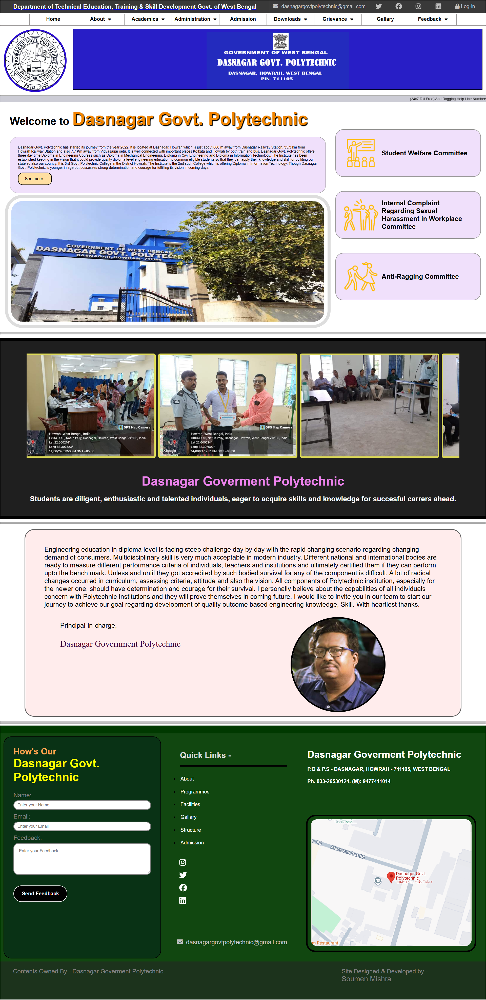

<div style="display: flex; align-items: center; justify-content: space-between; width: 100%;">
  <h1 style="flex: 0 0 80%; margin: 0;">DSP.college.Website-FE</h1>
  <a href="https://soumen044.github.io/DSP.college.Website-FE/" target="_blank" 
     style="flex: 0 0 20%; text-align: right; text-decoration: none;">
    <button style="
      background: linear-gradient(90deg, #ccc, #ccc);
      border: none;
      border-radius: 30px;
      color: black;
      padding: 10px 20px;
      font-size: 16px;
      font-weight: bold;
      cursor: pointer;
      transition: background 0.5s ease;">
      🚀 Live Demo
    </button>
  </a>
</div>

<script>
  const btn = document.querySelector("button");
  btn.addEventListener("mouseover", () => {
    btn.style.background = "linear-gradient(90deg, red, orange, yellow, green, blue, indigo, violet)";
    btn.style.color = "white";
  });
  btn.addEventListener("mouseout", () => {
    btn.style.background = "linear-gradient(90deg, #ccc, #ccc)";
    btn.style.color = "black";
  });
</script>


## 📖 Overview

This static frontend project represents the homepage design for **Dasnagar Government Polytechnic College**. It was developed as a 5th Semester major project during the Diploma in Information Technology Engineering (ITE) program under **WBSCTE**.

The design focuses on a **clean, responsive layout** ideal for academic presentations or prototyping college websites.

---

## 📂 Repository Structure

```
DSP.college.Website-FE/
├── index.html             # Core homepage HTML file
├── style.css              # Styling for layout & design
├── README.md              # Project documentation
└── images/                # Static images including college logo and visuals
    ├── logo.png
    ├── anti_ragging.png
    ├── board-collage.jpg
    ├── collage-pic1.png
    ├── front-side-collage.jpg
    ├── harassment.png
    ├── student_welfare.png
    ├── IMG-20240806-WA0003.jpg
    └── ...                # Other supporting images
```

---

## ✨ Features

- 📱 **Responsive design** compatible with desktops, tablets, and mobile devices
- 🧩 **Semantic and organized HTML/CSS** for ease of understanding and extensibility
- 🎨 **Visual emphasis** using images highlighting college activities and values
- 🏫 Inclusion of the official college **logo** and themed images placed in the `images/` folder

---

## 📸 Visual Preview

Below is the college logo and sample visuals incorporated in the homepage. Replace the placeholder paths with your actual image file names as needed.

<table>
  <tr>
    <th width="30%">College Logo</th>
    <th width="70%">College Banner</th>
  </tr>
  <tr>
    <td align="center">
      
    </td>
    <td align="center">
      
    </td>
  </tr>
</table>

### Desktop view



---

## 🚀 How to Run

Clone the repo and open the homepage locally in any modern browser:

```bash
git clone https://github.com/Soumen044/DSP.college.Website-FE.git
cd DSP.college.Website-FE
open index.html
```

---

## 🤝 Contribution

Contributions are welcome! To propose improvements:

- Fork this repository
- Create a feature branch (`feature/your-feature`)
- Commit your changes
- Push to your fork
- Open a Pull Request for review

---

## 📜 License

This project is mainly intended for **educational and demonstration purposes** as part of a diploma major project. No formal license is specified.

---

*Developed by [Soumen044](https://github.com/Soumen044/) for Diploma in Information Technology Engineering, WBSCTE.*
